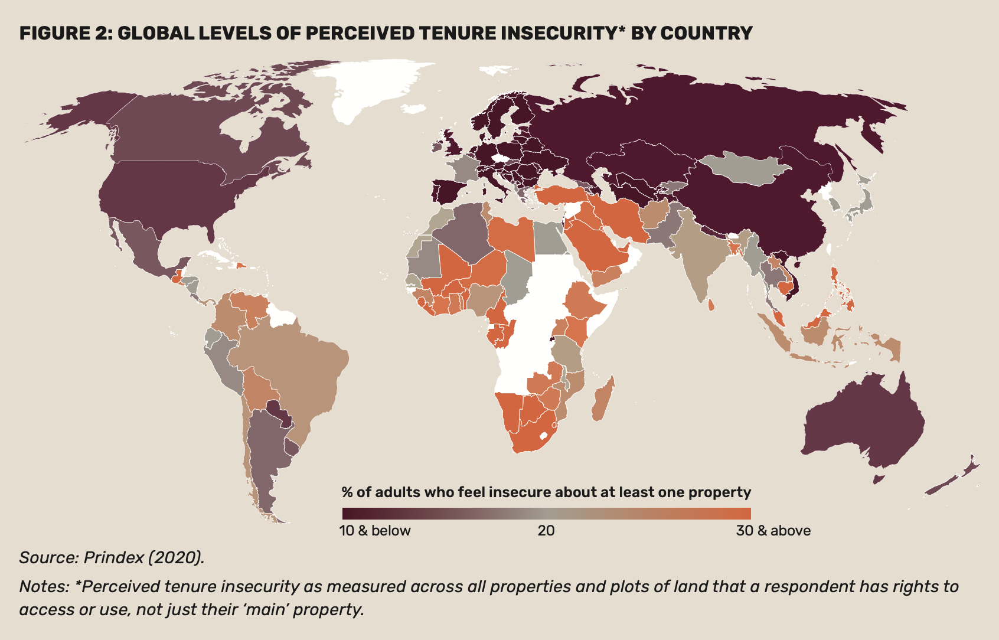

# The land rights problem

Land and home insecurity is a global problem with some estimates that 5.5 billion people (70% of earth's population) have legal rights to their land or homes but the lack the records to prove it. One billion of this number reported living in daily fear of losing their land, home, shop or farm. Without this documentation they face long-term insecurity and a critical barrier to building family wealth.

<figure><figcaption>
source: <a href="https://www.prindex.net/reports/prindex-comparative-report-july-2020/">https://www.prindex.net/reports/prindex-comparative-report-july-2020/</a>
</figcaption></figure>

Many centralized, government-run land tenure systems are falling short. They are difficult to access and tend to be expensive, time-consuming, and opaque while also vulnerable to corruption and fraud. Most are a hybrid system of various digital systems combined with hard-copy records. These physical documents are prone to mishandling and mismanagement. \
\
Many resources have been spent in the last decades to tackle this problem, in particular international development aid to countries in the Global South where this problem is most acute. But these have been large-scale, top-down approaches where partnering with existing, often change-resistant bureaucracies first means adding to (instead of replacing) a cumbersome process. Almost none have led to positive incremental change in their target jurisdictions.\
\
