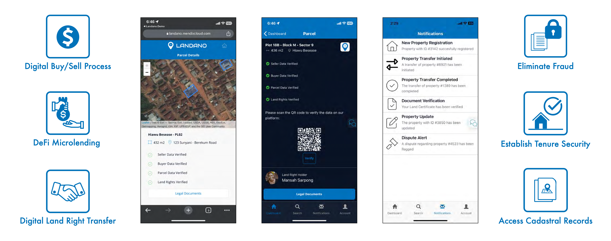

# The Landano solution

<figure><figcaption>
The Landano solution
</figcaption></figure>

Starting in sub-Saharan Africa, Landano fills a market opportunity in land administration for traditional leaders. These village chiefs and family heads have been given constitutional and legal authority to manage community lands, often on behalf of tens of thousands of rights holders.\
\
Landano offers these traditional leaders a user-friendly application to move land administration from an informal, verbal system (which leaves room for mismanagement, miscommunication and fraud) to a high-quality land administration system that is backed by Cardano blockchain proofs to eliminate double-spending, corruption, and memory loss.&#x20;

Landano is different than preceding land registry reformation initiatives because we are working directly with traditional leaders in this bottom-up, decentralized approach. Our methodology respects and strengthens the role of traditional leaders in the land administration process.\
\
This also means Landano is able to fill a record-keeping vacuum for millions of land rights holders in sub-Saharan Africa. These markets will be the basis of further global expansion of the Landano solution.

### How it works

The local traditional leaders that Landano is working with have constitutionally recognized authority over their communities, including property rights. This means we are able to onboard entire communities at once as soon as their leadership approves the collaboration.&#x20;

<figure><figcaption></figcaption></figure>

1. Local leaders and their representatives identify land parcels in their community and use Landano to enter cadastral information.
2. Landano generates NFTs for each land parcel using the Cardano blockchain and ISO standards.

<figure><figcaption>
Administer land rights
</figcaption></figure>

3. Community members identify available properties and land rights on the Landano platform using a mobile app.
4. Users make and receive sale offers for land ownership and other property rights.&#x20;
5. Changes in land rights are approved by community leaders on the Landano platform and minted as Cardano NFTs for ongoing verification and re-use.
6. Landano significantly improves upon manual fee collection and fills a critical records management gap which enables new economic opportunities for individual right holders and their local communities.

<figure><figcaption>
Available land rights for a property
</figcaption></figure>

