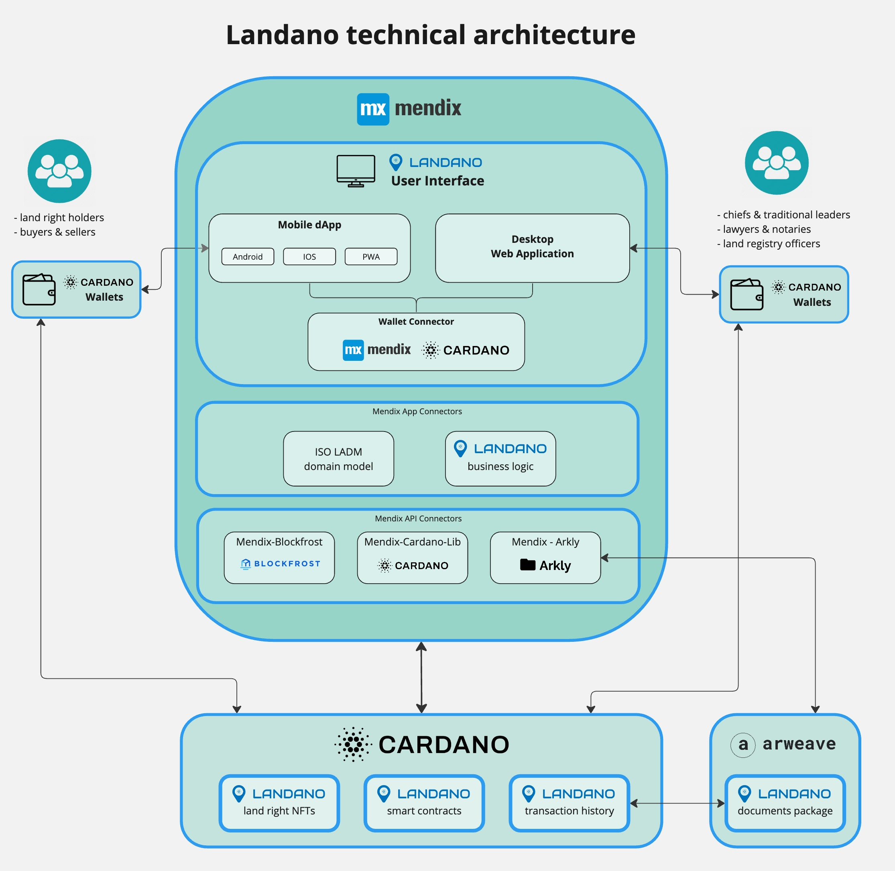

# Technical architecture

<figure><figcaption></figcaption></figure>

[Mendix](https://mendix.com) is primarily used to create and manage large portfolios of business-critical applications across organizational and technical boundaries. It is an integrated application platform-as-a-service (aPaaS) offering for designing, building, deploying, and managing enterprise apps. \
\
Mendix is classified by [Gartner](https://www.mendix.com/evaluation-guide/gartner-forrester-mendix/) as a low-code application platform that solves complex software development at scale and with speed. Mendix is the right fit for a platform like Landano, which is in the enterprise software market, given the roadmap to onboard millions of users.&#x20;

\
