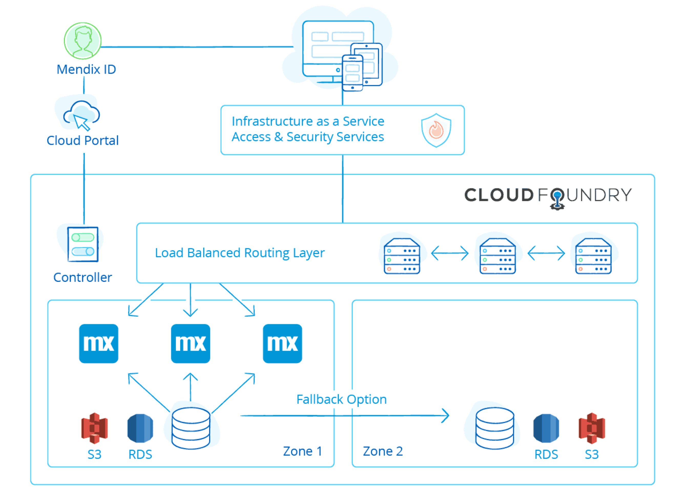

# Deployment architecture

The Landano platform is built on the Mendix platform to combine the best of battle-tested enterprise software with the trust guarantees provided by the decentralized Cardano blockchain.\
\
Mendix Cloud is a PaaS-based cloud offering based on Cloud Foundry technology that runs on the IaaS layer of Amazon Web Services. Our Landano Mendix application runs in containers hosted at Cloud Foundry. \
\
These containers have standard support for horizontal and vertical scaling as well as auto-healing. Scaling up and down can be done without any downtime by simply adding or removing containers. The Mendix Cloud Foundry layer is deployed in multiple availability zones for each AWS region. An availability zone is a physical data-center location of AWS within a region.

<figure><figcaption>
Mendix Cloud
</figcaption></figure>

A Mendix application needs a database and file storage to operate. In the Mendix Cloud, these aPaaS services are directly consumed from the AWS service layer. For the database, the Mendix Cloud makes use of RDS PostgreSQL, and for the file storage, it makes use of S3. Both of these services are Multi-AZ configured, so data is replicated across data centers.

### Permanent decentralized record-keeping

All this Mendix infrastructure is used as a processing pipeline for the Landano application modules. There are no permanent records stored within the Mendix platform. The records generated by Landano are stored as Cardano NFTs with supporting documentation packages provided on the permissionless Arweave storage network.&#x20;

<figure><figcaption></figcaption></figure>
